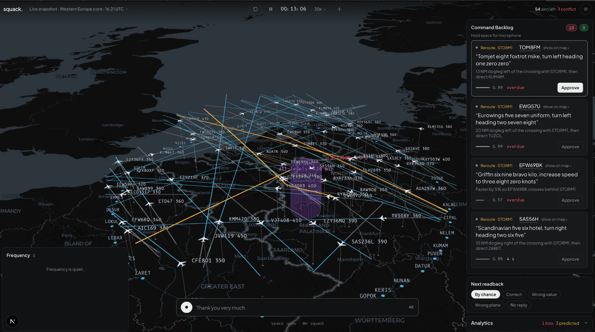

# squack.

An AI co-pilot for air traffic controllers, built in one weekend at [Hack the North 2026](https://hackthenorth.com) (Sept 18 to 20, University of Waterloo).

**🏆 Winner, ElevenLabs track · Finalist, Baseten track**

squack plans the best path for every flight, adapts the moment anything changes, and makes sure every instruction is heard and flown correctly. It plans and replans conflict-free paths in a simulator we built, transcribes noisy radio with a Whisper model we fine-tuned on Baseten, checks every pilot readback against its instruction, verifies on radar that each plane complies, and hands the messy cases to an investigating agent. AI pilots answer by voice (ElevenLabs) and sometimes get it wrong on purpose. The plane flies what the pilot said, not what the controller meant, so a missed readback shows up on radar. The controller stays in charge.

The project was called Tower while it was being built, and the code, the docs and the commit history still use that name in places: Tower and squack are the same thing.



## What is in it

Everything runs on one laptop with no API keys, on local models and deterministic mocks. Keys turn on the fine-tuned models, the real voices and the real agents.

| Piece | Where | Without keys | With keys |
|---|---|---|---|
| Simulator: flat-plane kinematics, flyable 1.5 deg/s turns, seeded scenarios, zones, intruders | `backend/sim` | Full | Same |
| Traffic: recorded real days from adsb.lol (4 regions, 8 hours), one-shot live snapshots, three built scenarios, a custom sky of 2 to 80 aircraft | `backend/sim/live.py`, `backend/scenarios` | Full; live falls back to a saved snapshot | Same |
| Planner: prioritized planning with local repair, never below 5 NM and 1,000 ft, instruction cards, back-on-course cards | `backend/planner` | Full | Same |
| Monte Carlo risk: 32 to 256 rollouts 120 s ahead every tick, conflict cones, confidence on every card, risk-triggered replan | `backend/planner/risk.py` | Full | Same |
| Disruptions: storm, closed airspace, fighter, drone, balloon, emergency, unknown, rocket; "Disrupt this flight" | `backend/disruptions.py` | Full | Same |
| Hearing: Whisper, callsign snapping, fix-name snapping, n-best hypotheses | `backend/tower/asr.py`, `callsign.py` | Local faster-whisper base.en | Our fine-tuned whisper-small on Baseten, local fallback per transmission |
| Understanding: plain-English patterns, phraseology grammar, interpreter agent | `backend/tower/freeform.py`, `parse.py`, `interpreter.py` | Patterns and grammar | Plus the interpreter agent on Baseten |
| Checking: normalizer, six-state clearance machine, rule checker, 8 error types, never alert if the value is in the top-5 hypotheses | `backend/tower/state.py`, `check.py` | Full | Plus the trained cross-encoder when `CHECKER_MODEL_URL` is set |
| Verifying: radar conformance against what was read back | `backend/tower/conform.py` | Full | Same |
| Resolver agent: 4 tool calls, about 5 s, ends in alert, dismiss or uncertain, trace on screen | `backend/tower/resolver` | Deterministic mock | Baseten model, Elasticsearch memory if configured |
| squack chat agent: the command bar, scoped tools over the world and the screen, no tool opens a clearance | `backend/agent` | Keyword router | OpenAI (`SQUACK_MODEL`), else Baseten |
| AI pilots: template readbacks, injected errors with ground truth logged, radio effect | `backend/pilots` | macOS `say` | ElevenLabs voices |
| Screen: 3D map, command bar, flight strip, command backlog, alerts with the correction to say, analytics, Manual and Autonomous | `frontend/` | Mock mode with a scripted demo | Live over WebSocket |
| Evaluation: three-arm Monte Carlo, density sweep, closest approach, miles versus fixed routes | `backend/eval` | Full | Same |
| Training: Whisper fine-tune, WER evaluation, checker data and cross-encoder, Baseten job and serving configs | `training/` | Laptop runs | Baseten H100 jobs, T4 serving |

## Numbers we measured

All measured by us. Real-traffic runs use adsb.lol snapshots from 2026-09-18. Say which is which on stage, and never blend a simulated figure with a real-traffic one.

Every Monte Carlo run has three arms with common random numbers: **fixed** (aircraft fly their filed routes), **plan only** (squack issues instructions, a wrong readback is flown uncorrected) and **squack** (the same, plus the wrong readback is caught and corrected).

| Run | Fixed routes | Plan only | squack |
|---|---|---|---|
| Density sweep, 1x to 3x traffic, 5% readback errors, 40 runs, 826 flight hours | 1,016 losses of separation, 1.14 per flight hour | 9 losses | **1 loss, 0.0012 per flight hour**, 7.1% fewer miles |
| Dense scenario, 15% readback errors, 20 runs | 150 losses, closest approach 0.01 NM | 4 losses, 0 of 142 errors caught | **0 losses, closest 7.23 NM, 121 of 121 caught** |
| Real Europe, 159 flights, 20 runs, 1,314 flight hours | 258 losses, 0.196 per flight hour | 47 losses | **36 losses, 0.027 per flight hour (86% fewer)**, 75 conflicts predicted, 40 resolved |
| Real US northeast, 44 flights, 20 runs | 5 losses, closest 1.56 NM | 0 losses | **0 losses, closest 9.06 NM** |

Miles saved is about 7% on the built scenarios at every density, and only 0.2 to 0.6% on real traffic, because real en-route tracks are already close to direct. Live snapshots show none by construction (routes are straight projections). Do not put a savings claim over the live sky.

| Model | Result | How |
|---|---|---|
| **Fine-tuned Whisper, 1,000 held-out real ATC clips** | **word error rate 0.708 stock to 0.155 tuned**, 78% fewer errors | whisper-small, one Baseten H100, 71 min, 21,269 clips (11,268 real, 7,601 ATCOSIM, 2,400 of our own simulator audio). `training/RUNS.md`, `docs/12-baseten-stats.md` |
| Same model on our own demo audio | 0.202 stock to 0.035 tuned; made-up fix names exactly right 81 of 126 (was 1 of 126); on the ElevenLabs demo voices 13 of 20 (was 0 of 20) | 299 simulator clips in a voice no run trained on; 20 ElevenLabs clips |
| Serving | 0.3 s at beam 1, 0.8 s at beam 3, 1.7 s at beam 5, n-best returned | Baseten T4 |
| Readback checker cross-encoder | accuracy 0.894, detection 0.908, false alarm rate 0.085, 7 ms per pair | distilroberta-base, 12k synthetic pairs, 10 min on the laptop GPU, evaluated on 5,000 held-out synthetic pairs |
| Laptop baseline | tuned whisper-tiny 0.217 beats stock tiny 1.18, base 1.11, small 0.69 on 300 real clips | One hour on a 16 GB MacBook |

| Speed | Result |
|---|---|
| Conflict prediction | about 440,000 futures per second, 5.3 ms for 256 rollouts with 9 aircraft; the rollout count adapts to the tick budget |
| Replan | 15 to 170 ms, 0.6 s worst case with 107 aircraft; first turn about 2 s after a disruption |
| Key release to aircraft turning | about 1 s; the plane acts before the voice is synthesized |
| Interpreter agent | 0.5 to 3.4 s, capped at 6 s, off the clock |
| Backend tests | 513 |

## Run it

Three terminals. Python 3.11 or newer, Node 20 or newer, `uv`, `ffmpeg`.

```bash
# 1. backend
cd backend
uv venv .venv && uv pip install -e ".[dev]"
.venv/bin/pytest -q                      # 513 tests
.venv/bin/uvicorn app:app --port 8000    # first start downloads whisper base.en, about 150 MB

# 2. frontend
cd frontend
npm install
npm run dev                              # http://localhost:3000, mock mode if no backend

# 3. optional: training
cd training
uv venv .venv && uv pip install -r requirements.txt
.venv/bin/python prep_data.py --subset 200      # or no flag for the full 822 MB dataset
.venv/bin/pytest tests -q
```

On the screen: the setup dialog opens. Pick a source (a live region, a recorded real hour, a built scenario, or a custom sky), load it, and press **Start**. Nothing moves until you do. Then:

- **Manual** (the default): a card appears in the Command Backlog. Hold **Space** and read it into the mic, or press **Let squack say it**. The pilot reads it back by voice a couple of seconds later. Set **Next readback** to Wrong value first to see the red alert and the correction to say.
- **Autonomous**: the same planner, but every card goes by data link instantly and nobody speaks. The switch is in the menu at the top right.
- **Disrupt**: the round button in the top bar drops a storm, a closed airspace, a fighter or a mayday where you click, or **Disrupt this flight** on a selected aircraft's strip puts one on its path. Watch the replan and the cones.
- **Talk to squack**: hold **⌘⇧** (Ctrl+Shift off Mac) or press ⌘K and ask: "which two flights are closest", "put a storm on Delta 789", "why did you turn United", "double the traffic".
- **Plain English on the radio works too**: "turn around", "make a left three sixty", "climb another two thousand", "disregard". An impossible request gets "unable" from the pilot.

Environment variables, all optional, in `.env` (copy `.env.example`):

| Variable | Effect |
|---|---|
| `BASETEN_API_KEY`, `EXTRACTOR_MODEL`, `RESOLVER_MODEL`, `LLM_TIMEOUT_S` | Real model for the resolver, the interpreter, the extractor fallback and the world builder. Without a key, deterministic mocks |
| `OPENAI_API_KEY`, `SQUACK_MODEL` | The squack chat agent only, default `gpt-4o-mini`. Without them it uses Baseten, and without a Baseten key the keyword router. Everything else stays on Baseten |
| `ASR_MODEL_URL`, `ASR_STOCK_MODEL_URL`, `ASR_BEAM_SIZE`, `ASR_CONTROLLER_BEAM`, `ASR_CONTROLLER_TIMEOUT_S`, `ASR_KEEP_WARM_S`, `ASR_STOCK_LOCAL` | The fine-tuned Whisper on Baseten and the stock model beside it for the on-screen comparison. Without them, local faster-whisper. Deployment: `training/BASETEN.md` |
| `ASR_LOCAL_MODEL` | faster-whisper size or a CTranslate2 directory, default `base.en`. Also the per-transmission fallback when Baseten cannot be reached |
| `CHECKER_MODEL_URL` | The cross-encoder endpoint, see `training/serve_checker.py`. Without it, rules only |
| `ELEVENLABS_API_KEY`, `ELEVENLABS_VOICE_IDS`, `ELEVENLABS_CONTROLLER_VOICE_ID`, `ELEVENLABS_MODEL_ID`, `TTS_BACKEND` | Pilot and controller voices. Without a key, macOS `say` |
| `SQUACK_SPEAK`, `SQUACK_VOICE_ID` | Whether squack's answers are spoken, and in which voice |
| `ELASTIC_URL`, `ELASTIC_API_KEY` | Elasticsearch as the resolver's searchable memory: every transmission, clearance, verdict and radar frame is indexed live and the agent's tools search it. Without them, in-memory lists. `docs/11-elastic-memory.md`; prove it with `python tools/elastic_check.py` |
| `TOWER_SCENARIO`, `TOWER_AUTOSTART=1`, `TOWER_SIM_SPEED`, `TOWER_VOICE`, `TOWER_SYNTHESIZE=0`, `TOWER_DATA_DIR`, `TOWER_LOG` | Headless and demo switches: preload a scenario, start it, clock speed, voice on, audio off, data directory, log level |

Other commands:

```bash
# real traffic: put an adsb.lol daily archive (three tar parts) in data/real/raw, then
cd backend && .venv/bin/python tools/real_extract.py --date 2026-09-18   # one pass, about a minute
cd backend && .venv/bin/python tools/real_build.py                        # writes backend/scenarios/real/*.json
# Monte Carlo
cd backend && .venv/bin/python -m eval.run_eval --scenario dense --runs 20 --error-rate 0.15
cd backend && .venv/bin/python -m eval.run_eval --scenario real/europe-core_2026-09-18_1600 --runs 20
cd backend && .venv/bin/python -m eval.sweep                              # density curve, docs/img/density-sweep.png
# hear one wrong readback
cd backend && .venv/bin/python -m pilots.demo_voice wrong_value 0.3
# word error rate
cd training && .venv/bin/python eval_wer.py --stock openai/whisper-small --limit 100
```

## Deploy

Two pieces: the screen on Vercel, the backend in a container on Fly.io, wired by two environment variables. **`docs/14-deploy-handoff.md` is the step-by-step, written to be followed by a person or their Claude session, with a check after every step.** The short version:

- **Screen.** `cd frontend && vercel link && vercel --prod`. Through the dashboard instead, import the repo and set Root Directory to `frontend`. With no backend configured, a hosted copy opens on the scripted demo. To attach a backend, set `NEXT_PUBLIC_TOWER_WS` (a `wss://` address), `NEXT_PUBLIC_TOWER_HTTP` and `NEXT_PUBLIC_TOWER_TOKEN` before the production build.
- **Backend.** `cd backend && fly launch --copy-config --no-deploy && fly secrets set TOWER_TOKEN=... && fly deploy`. `backend/Dockerfile` bakes in ffmpeg and the local Whisper model; `backend/fly.toml` keeps one 2 GB machine running with a health check. Set `TOWER_TOKEN`: it is the only thing between the internet and your API keys, and it holds one shared world, so host it for a demo you drive, not as a public playground.

Never run a plain `npm run build` while `npm run dev` is up: it overwrites `.next` and the dev page loses its CSS. Use `NEXT_DIST_DIR=.next-verify npm run build` to check a production build.

## For teammates

Start with [CLAUDE.md](CLAUDE.md), then [docs/01-project.md](docs/01-project.md). Claude Code loads `CLAUDE.md` automatically.

| Doc | What is in it |
|---|---|
| [docs/01-project.md](docs/01-project.md) | The idea, prize targets, judging criteria |
| [docs/02-domain.md](docs/02-domain.md) | How ATC radio works, phraseology, the error taxonomy |
| [docs/03-architecture.md](docs/03-architecture.md) | Pipeline, schemas, resolver agent, base WebSocket events |
| [docs/04-training.md](docs/04-training.md) | Datasets, recipes, evaluation, Baseten setup |
| [docs/05-data-and-legal.md](docs/05-data-and-legal.md) | What audio we may and may not use |
| [docs/06-plan.md](docs/06-plan.md) | Deadlines, milestones, cut list |
| [docs/07-build-spec.md](docs/07-build-spec.md) | The researched build spec. Wins over 03 and 04 |
| [docs/08-ws-protocol.md](docs/08-ws-protocol.md) | Client and server messages |
| [docs/09-overnight-findings.md](docs/09-overnight-findings.md) | What the overnight build learned that the spec did not know |
| [docs/10-roadmap.md](docs/10-roadmap.md) | The working roadmap: Start button, real map, real traffic, disruptions, Manual and Autonomous. Wins over 06 and the TRDs |
| [docs/11-elastic-memory.md](docs/11-elastic-memory.md) | The resolver's searchable memory on Elasticsearch |
| [docs/12-baseten-stats.md](docs/12-baseten-stats.md) | One page of Baseten numbers for the sponsor track |
| [docs/13-ui-inventory.md](docs/13-ui-inventory.md) | Every piece of the screen and what a user can do with it |
| [docs/14-deploy-handoff.md](docs/14-deploy-handoff.md) | Deploying the screen to Vercel and the backend to Fly.io, step by step with checks |
| [docs/trd/](docs/trd/) | The build TRDs: pre-ship gaps, models, planner and data, screen and demo, the Monte Carlo spec, the squack agent PRD |

## Third-party models, datasets, and libraries

Hack the North requires attribution. Keep this current.

- Flight data: [adsb.lol globe_history](https://github.com/adsblol/globe_history_2026), open under ODbL 1.0 and CC0. The built scenarios in `backend/scenarios/real/` are derived from the 2026-09-18 archive. Gate names in those scenarios are ours. Live mode (`backend/sim/live.py`) takes one snapshot per load from the [adsb.lol API](https://api.adsb.lol) under the same licence, and falls back to a saved snapshot or a recorded hour if the feed is down
- Map: [MapLibre GL](https://maplibre.org), [deck.gl](https://deck.gl), basemap by [CARTO](https://carto.com/attributions) on OpenStreetMap data. Type: Plus Jakarta Sans, B612 and B612 Mono (Airbus, OFL)
- Datasets: [jacktol/atc-dataset](https://huggingface.co/datasets/jacktol/atc-dataset) (ATCO2 one-hour subset plus UWB-ATCC, MIT per the card), [jlvdoorn/atco2-asr-atcosim](https://huggingface.co/datasets/jlvdoorn/atco2-asr-atcosim) (ATCOSIM, used in the deployed run). No LiveATC audio anywhere: their terms forbid it
- Base models: OpenAI Whisper (tiny, base, small), distilroberta-base
- Speech tooling: faster-whisper and CTranslate2, silero-vad, Hugging Face transformers and datasets, jiwer
- Voices: [ElevenLabs](https://elevenlabs.io) for the pilots, the controller and squack; macOS `say` without a key
- Inference and training: [Baseten](https://www.baseten.co) for the Whisper fine-tune (H100), Whisper serving (T4) and the resolver and interpreter models; [OpenAI](https://openai.com) for the squack chat agent only
- Search: [Elastic Cloud Serverless](https://www.elastic.co/) holds the resolver's searchable memory when configured
- Backend: FastAPI, Pydantic, numpy, scipy, rapidfuzz, OpenAI Python SDK, Elasticsearch Python client
- Frontend: Next.js, React, Tailwind CSS
- Research this design follows: HAAWAII readback error detection (DLR, NATS, Isavia), SCOPE, the Idiap virtual simulation pilot. Links in `docs/07-build-spec.md`
