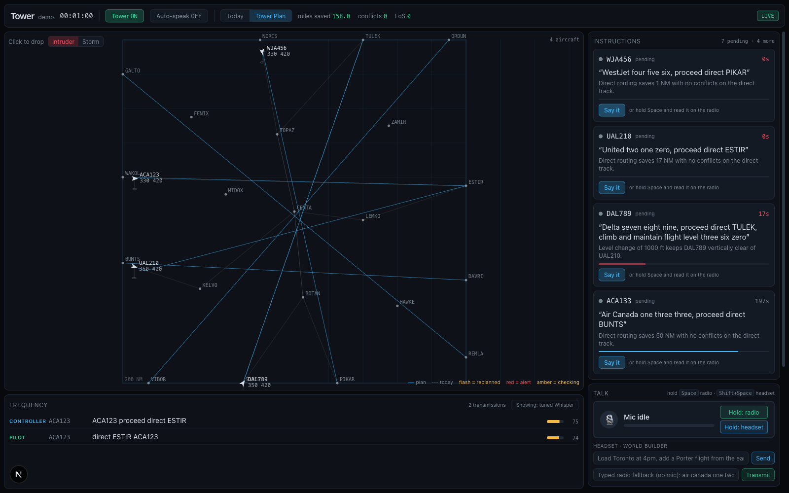

# Tower

An AI system for air traffic control, built at Hack the North 2026.

Tower plans the best path for every flight, adapts the moment anything changes, and makes sure every instruction is heard and flown correctly. It plans and replans conflict-free paths in a simulator we built, transcribes noisy radio with Whisper, checks every pilot readback against its instruction, verifies on radar that each plane complies, and hands the messy cases to an investigating agent. AI pilots answer by voice and sometimes get it wrong. The plane flies what the pilot said, not what the controller meant, so a missed readback shows up on radar.



## What works right now

Built overnight Sept 19 to 20 on branch `joey/overnight-build`. Everything below runs on one laptop with no API keys. See `docs/trd/01-pre-ship.md` for what is missing.

| Piece | Status | Evidence |
|---|---|---|
| Shared schemas and WebSocket protocol | Done | `backend/schemas.py`, `docs/08-ws-protocol.md` |
| Simulator: flat-plane kinematics, seeded scenarios, intruders, storms | Done | `backend/sim`, 7 tests |
| Planner: prioritized planning, conflict test, replan, emergency layer, instruction cards | Done | `backend/planner`, 6 tests. Demo scenario plans in 14 ms with 0 conflicts |
| Tower core: normalizer, callsign snap, grammar parser, six-state machine, rule checker, n-best rule, radar conformance | Done | `backend/tower`, 85 tests |
| Resolver agent: hand-rolled tool loop, 4-call cap, always terminates | Done, mock LLM without a key | `backend/tower/resolver`, trace emitted as events |
| AI pilots: template readbacks, all 8 error types, voice via macOS `say`, radio effect | Done, ElevenLabs client written but untested | `backend/pilots`, 37 tests |
| Speech: local faster-whisper base.en for both sides of the radio, n-best re-listen, Baseten client written | Done locally | `backend/tower/asr.py` |
| World-builder agent: voice or text, loads scenarios, spawns flights, drops intruders, multiplies traffic | Done, keyword parser without a key, tool loop with one | `backend/world_agent.py` |
| FastAPI app, WebSocket hub, 1 Hz clock, audio serving | Done | `backend/app.py`, `backend/world.py`, 8 end-to-end tests |
| Next.js screen: radar, plan toggle, cards, alerts, agent trace, transcript, scoreboard, sliders, push-to-talk, mock mode | Done | `frontend/`, builds clean |
| Monte Carlo evaluation: three arms, LoS per flight hour, closest approach, miles saved | Done | `backend/eval`, numbers below |
| Training: data prep on the real public dataset, Whisper fine-tune, WER eval, checker data generation, cross-encoder train and serve, Baseten job configs | Scripts done and smoke-tested; laptop runs only | `training/`, `training/RUNS.md` |
| Whisper fine-tuned | Laptop run done: tuned tiny beats stock small on real clips. Baseten H100 run not started, no key | `training/RUNS.md`, `docs/trd/02-models-and-baseten.md` |
| Real ADS-B traffic, replay comparison | Not started | `docs/trd/03-planner-data-eval.md` |
| Monte Carlo risk prediction: cones before a conflict, risk-triggered replan, confidence on cards | In progress, pending measurement | `backend/planner/risk.py`, `docs/trd/07-monte-carlo-spec.md` |
| ElevenLabs voices, demo script, backup video, Devpost | Not started | `docs/trd/04-screen-pilots-demo.md` |

**The voice loop is real.** Tower speaks a card through macOS speech, passes it through a radio filter, and hears it with Whisper. The AI pilot answers through its own voice and radio filter, and Whisper hears that too. Tower never reads the pilot's text. Round trip on this laptop is about 4 seconds.

## Numbers measured so far

All measured by us on this laptop. Say which is which on stage.

| Metric | Value | How |
|---|---|---|
| Losses of separation, fixed routes | 0.34 per flight hour, closest 0.04 NM | Monte Carlo, demo scenario, 20 runs, 2 percent readback errors |
| Losses of separation, Tower plan, validation on or off | 0 per flight hour, closest 9.4 NM | Same runs |
| Miles vs fixed routes | 7.8 to 8.3 percent fewer | Same runs. Winds and aircraft performance excluded |
| Readback errors caught, Tower on | 4 of 4 injected | Same runs; simulated at the command level, no audio |
| Density sweep, dense scenario 1x to 2.5x traffic | Fixed routes 0.63 to 1.60 LoS per flight hour; Tower with validation 0 to 0.011; 6 to 8 percent fewer miles at every density | `python -m eval.sweep`, chart in `docs/img/density-sweep.png`, 4 runs per point |
| Dense scenario at 5 percent errors, 20 runs | fixed 154 LoS, Tower without validation 1 LoS, Tower with validation 0 | `python -m eval.run_eval --scenario dense --runs 20 --error-rate 0.05` |
| Checker cross-encoder, synthetic held-out 5,000 pairs | accuracy 0.894, false alarm rate 0.085, detection 0.908, 7 ms per pair | distilroberta-base, 12k pairs, 10 min on the laptop GPU |
| Stock Whisper word error rate on 300 real held-out ATC clips | tiny 1.18, base 1.11, small 0.69 | jacktol/atc-dataset test split, greedy, both sides normalized. Matches the published 63 percent for small |
| **Fine-tuned Whisper, same 300 real held-out clips** | **tuned tiny 0.217** vs stock tiny 1.18, stock base 1.11, stock small 0.69 | whisper-tiny, 11k real clips, 1,200 steps, 62 min on the laptop GPU. `training/results/wer_comparison.json`, `training/RUNS.md`. Beats all three stock sizes on real radio and is the fastest |
| Fine-tuned Whisper on the synthetic pilot voices | Worse than stock base.en ("air china" for "air canada") | Domain shift: the dataset is European radio, the demo voices are macOS `say`. Tier 1 stays on stock base.en locally; the tuned model is the real-clip comparison. Fix is TRD 02 task 4, mixing simulator audio into training |
| Tier 1 latency | about 0.8 s after speech recognition, 1.2 to 1.5 s for local Whisper per clip | Live session |
| Conflicts predicted before they exist | measured futures per second and lead time: pending integration | `backend/planner/risk.py`, TRD 07 |

## Run it

Three terminals. Python 3.11 or newer, Node 20 or newer, `uv`, `ffmpeg`.

```bash
# 1. backend
cd backend
uv venv .venv && uv pip install -e ".[dev]"
.venv/bin/pytest -q                      # 412 tests
.venv/bin/uvicorn app:app --port 8000    # first start downloads whisper base.en, about 150 MB

# 2. frontend
cd frontend
npm install
npm run dev                              # http://localhost:3000, falls back to mock mode if no backend

# 3. optional: training
cd training
uv venv .venv && uv pip install -r requirements.txt
.venv/bin/python prep_data.py --subset 200      # or no flag for the full 822 MB dataset
.venv/bin/pytest tests -q
```

Then in the browser: the setup panel opens. Pick a scenario and press Load, look over the plan, then press **Start**. Nothing moves and the radio is closed until you do. Speed is 1x, 5x, 20x, or 60x, and voice only keeps up at 1x. Then click "Say it" on a card, or hold Space and read the card into the mic, or type in the radio box. The pilot answers in a few seconds. Drag the pilot error rate slider up to see red cards. Type "put a fighter jet through the middle" in the headset box to see a replan. Toggle Tower off and repeat a wrong readback to watch the plane fly it.

Environment variables, all optional, in `.env` (copy `.env.example`):

| Variable | Effect |
|---|---|
| `BASETEN_API_KEY`, `EXTRACTOR_MODEL`, `RESOLVER_MODEL` | Real LLM for the resolver, extractor fallback, and world builder. Without it, deterministic mocks |
| `ASR_MODEL_URL`, `ASR_STOCK_MODEL_URL` | Baseten Whisper endpoints. Without them, local faster-whisper |
| `ASR_LOCAL_MODEL` | faster-whisper size or a CTranslate2 directory, default `base.en`. Also what the app falls back to, per transmission, when the Baseten model cannot be reached. Deployment: `training/BASETEN.md` |
| `CHECKER_MODEL_URL` | Cross-encoder endpoint, see `training/serve_checker.py`. Without it, rules only |
| `ELEVENLABS_API_KEY` | Pilot voices. Without it, macOS `say` |
| `ELASTIC_URL`, `ELASTIC_API_KEY` | Elasticsearch as the resolver's searchable memory: every transmission, clearance, verdict and radar frame is indexed live and the agent's tools search it (BM25, geo, time series, fuzzy fix names). Without them, in-memory lists. See `docs/11-elastic-memory.md`; prove it with `python tools/elastic_check.py` |
| `TOWER_SCENARIO`, `TOWER_AUTOSTART=1`, `TOWER_SIM_SPEED`, `TOWER_SYNTHESIZE=0` | Preload a scenario to ready, also start it (headless runs), initial clock speed, disable audio entirely |

Other commands:

```bash
# live sky needs no setup: pick Live and a region on the screen (one request to adsb.lol, see backend/sim/live.py)
# real traffic: put an adsb.lol daily archive (three tar parts) in data/real/raw, then
cd backend && .venv/bin/python tools/real_extract.py --date 2026-09-18   # one pass, about a minute
cd backend && .venv/bin/python tools/real_build.py                        # writes backend/scenarios/real/*.json
cd backend && .venv/bin/python -m eval.run_eval --scenario demo --runs 20   # Monte Carlo table
cd backend && .venv/bin/python -m pilots.demo_voice wrong_value 0.3         # hear one wrong readback
cd training && .venv/bin/python eval_wer.py --stock openai/whisper-small --limit 100
```

## For teammates

Start with [CLAUDE.md](CLAUDE.md), then [docs/01-project.md](docs/01-project.md), then the TRD for your stream. Claude Code loads `CLAUDE.md` automatically.

| Stream | TRD | Owns |
|---|---|---|
| Models and Baseten | [docs/trd/02-models-and-baseten.md](docs/trd/02-models-and-baseten.md) | Whisper fine-tune on H100, checker on Baseten, serving, measured word error rate |
| Planner, real data, evaluation | [docs/trd/03-planner-data-eval.md](docs/trd/03-planner-data-eval.md) | ADS-B starting traffic, replay comparison, density curve, planner gaps |
| Screen, pilots, demo | [docs/trd/04-screen-pilots-demo.md](docs/trd/04-screen-pilots-demo.md) | ElevenLabs, UI polish, demo script, backup video, Devpost |
| Everything pre-ship | [docs/trd/01-pre-ship.md](docs/trd/01-pre-ship.md) | The full gap list, ordered |

| Doc | What is in it |
|---|---|
| [docs/01-project.md](docs/01-project.md) | The idea, prize targets, judging criteria, demo script |
| [docs/02-domain.md](docs/02-domain.md) | How ATC radio works, phraseology, the error taxonomy |
| [docs/03-architecture.md](docs/03-architecture.md) | Pipeline, schemas, resolver agent, base WebSocket events |
| [docs/04-training.md](docs/04-training.md) | Datasets, recipes, evaluation, Baseten setup |
| [docs/05-data-and-legal.md](docs/05-data-and-legal.md) | What audio we may and may not use |
| [docs/06-plan.md](docs/06-plan.md) | Deadlines, milestones, cut list |
| [docs/07-build-spec.md](docs/07-build-spec.md) | The researched build spec. Wins over 03 and 04 |
| [docs/08-ws-protocol.md](docs/08-ws-protocol.md) | Client and server messages |
| [docs/09-overnight-findings.md](docs/09-overnight-findings.md) | What the overnight build learned that the spec did not know |
| [joey-notes.md](joey-notes.md) | Joey's positioning proposal: density thesis, supervisor mode, real data |

## Third-party models, datasets, and libraries

Hack the North requires attribution. Keep this current.

- Flight data: [adsb.lol globe_history](https://github.com/adsblol/globe_history_2026), open under ODbL 1.0 and CC0. The built scenarios in `backend/scenarios/real/` are derived from the 2026-09-18 archive. Gate names in those scenarios are ours. Live mode (`backend/sim/live.py`) takes one snapshot per load from the [adsb.lol API](https://api.adsb.lol) under the same licence, and falls back to a saved snapshot or a recorded hour if the feed is down
- Map: [MapLibre GL](https://maplibre.org), [deck.gl](https://deck.gl), basemap by [CARTO](https://carto.com/attributions) on OpenStreetMap data. Type: B612 and B612 Mono (Airbus, OFL)
- Datasets: [jacktol/atc-dataset](https://huggingface.co/datasets/jacktol/atc-dataset) (ATCO2 one-hour subset plus UWB-ATCC, MIT per the card), [jlvdoorn/atco2-asr-atcosim](https://huggingface.co/datasets/jlvdoorn/atco2-asr-atcosim) (referenced, not yet used)
- Base models: OpenAI Whisper (tiny, base, small), distilroberta-base and roberta-base
- Speech tooling: faster-whisper and CTranslate2, silero-vad, Hugging Face transformers and datasets, jiwer
- Voices: macOS `say`; ElevenLabs client written
- Infrastructure: Baseten training and inference (job configs written; nothing submitted yet)
- Backend: FastAPI, Pydantic, numpy, scipy, rapidfuzz, OpenAI Python SDK, Elasticsearch Python client
- Search: [Elastic Cloud Serverless](https://www.elastic.co/) holds the resolver's searchable memory when configured
- Frontend: Next.js, React, Tailwind CSS
- Research this design follows: HAAWAII readback error detection (DLR, NATS, Isavia), SCOPE, the Idiap virtual simulation pilot. Links in `docs/07-build-spec.md`
